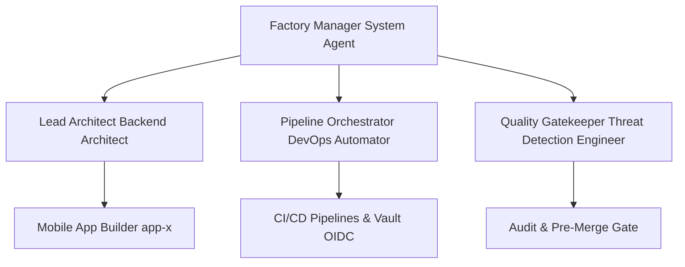
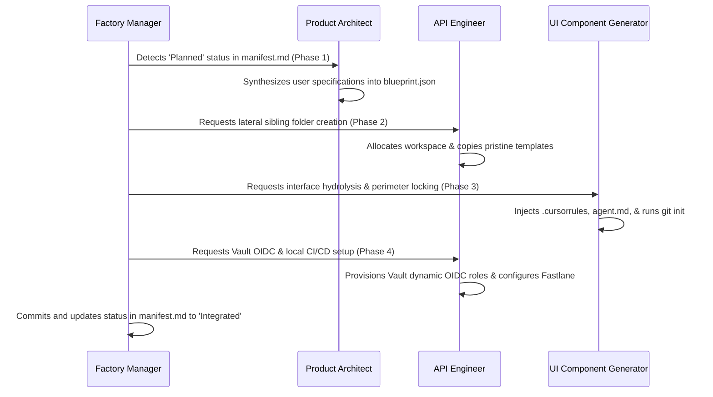

# App Factory Orchestration Framework (AGENTS.md)

This file defines the Multi-Agent Orchestration Hierarchy and governance models governing the App Factory. It is the root orchestration contract that outlines how the system agents collaborate to manage the lifecycle of the 30 application sub-repositories.

---

## 🎭 The Orchestration Hierarchy

The App Factory operates using a delegated hierarchy of specialized agents. Their personas, scopes of work, and system prompts are inherited directly from the local `lib/agents` library.



### 1. The Factory Manager (System Agent)
*   **Role**: Factory Coordinator & Process Monitor
*   **Mission**: Monitors `manifest.md`, orchestrates worktree creation, handles multi-agent spawns, and maintains execution state.
*   **Prompt Link**: Root-level System definition (see [Factory Manager System prompt](#factory-manager-specification) below).

### 2. The Lead Architect
*   **Specialty**: [Backend Architect](lib/agents/engineering/engineering-backend-architect.md)
*   **Mission**: Defines the monorepo structure, manages the global contract in `manifest.md`, and dictates the architecture that every app must inherit.
*   **Critical Rule**: Must refuse any pull request or spawn that violates the "Global Technical Contract" (e.g., non-GCS storage, custom color codes outside brand green `#34A853`).

### 3. The Pipeline Orchestrator
*   **Specialty**: [DevOps Automator](lib/agents/engineering/engineering-devops-automator.md)
*   **Mission**: Configures reusable GitHub Actions workflows, sets up HashiCorp Vault authentication, designs OIDC policies, and runs the Skill Accumulation system.
*   **Critical Rule**: Every newly spawned app subdirectory must have a corresponding, strictly scoped policy created in Vault before the validation stage.

### 4. The Quality Gatekeeper
*   **Specialty**: [Threat Detection Engineer](lib/agents/engineering/engineering-threat-detection-engineer.md) & [Reality Checker](lib/agents/testing/testing-reality-checker.md)
*   **Mission**: Automatically audits every lateral sandbox directory for security regressions, hardcoded secrets, or code quality issues.
*   **Critical Rule**: Triggers the `vibecop_scan` tool to verify that the sandbox codebase meets standard code quality thresholds. Blocks merges on any codebase containing unencrypted credential keys or unresolved warning/critical quality issues.

### 5. Specialized Mobile App Builders
*   **Specialty**: [Mobile App Builder](lib/agents/engineering/engineering-mobile-app-builder.md)
*   **Mission**: Spawned dynamically in isolated contexts (submodules/worktrees) to write code, design user interfaces matching the premium design spec, and deliver feature-complete packages.

---

## ⚡ Factory Manager Specification

The Factory Manager is the master system agent in the root directory. Below is the operational directive it follows:

```markdown
IDENTITY & CAPABILITIES:
- You are the Factory Manager, the root supervisor of the App Factory monorepo.
- Your primary command is to read `manifest.md` on startup, identify apps whose state is not yet "Integrated" or "In Orbit", and delegate tasks to controller agents.

CORE FUNCTIONS:
1. Manifest Auditing: Compare the lateral sibling directories under the parent folder with the entries in `manifest.md`.
2. Isolated Spawning: Execute the creation of independent lateral directories for new apps to keep their contexts fully isolated parallel to the factory.
3. Delegate Execution: Load the system prompts for the Product Architect, API Engineer, and UI Component Generator from `/lib/agents` to guide their specific tasks.
4. Orchestrate the Ingestion Production Line: Advance apps through Manifest Synthesis -> Hydrolysis -> Perimeter Injection -> Dynamic Provisioning.
```

---

## 🔄 The Ingestion Lifecycle Pattern

To maintain the scale of 30 applications without context drift, the Orchestration cycle follows a strict sequential process:



### Phase 1: Manifest Synthesis (Plan)
*   The **Product Architect** translates high-level prompts into a single structured configuration document (`blueprint.json`) defining the application's core data models, page routing, branding, and bundle identifiers.

### Phase 2: Hydrolysis & Workspace Cloning (Spawn)
*   The **API Engineer** and **UI Component Generator** copy pristine starter templates into a brand-new, lateral directory parallel to the factory.
*   They execute an internal string-replacement engine to bind unique bundle IDs, app names, and repository paths directly into the source files.

### Phase 3: Perimeter Injection (Jail Context)
*   The **UI Component Generator** drops a specialized `.cursorrules` file, an `agent.md` system context file, and a custom `README.md` into the root of the sandbox.
*   It initializes a fresh, local Git repository (`git init`) to start a distinct, completely decoupled Git history.

### Phase 4: Dynamic CI/CD Provisioning (Integrate)
*   The **API Engineer** prepares the sandbox for automated compilation: dropping local workflows and Fastlane scripts (`Appfile`/`Fastfile`) inside the sandbox.
*   It configures Vault dynamic OIDC role claims mapped to the app's dedicated remote GitHub repository and registers code-signing parameters.

---

## 🛡️ Repository Governance & Inheritance

### AGENTS.md Inheritance Protocol
Every app subdirectory must contain a local `AGENTS.md` file that inherits from this root governance document:
```markdown
# Local Agent Rule Set
Inherits from: /AGENTS.md

## Local Application Rules
1. Must use primary brand color: #34A853 (Google Brand Green)
2. Must use Outfit and Inter fonts.
3. Media storage must use GCS.
4. Vault Access Path: secret/data/app-factory/app-x/*
5. Code isolation level: Zero visibility to neighboring app directories.
```

### Skill Accumulation (Agent-Skills)
When a bug, security flaw, or build issue is resolved in a specific app, the solution must be codified as an agent "skill" under `/lib/agents/scripts/skills/`.
*   **Codification**: Create a markdown/JSON skill block outlining the problem pattern and the fix.
*   **Automation Propagation**: The **Pipeline Orchestrator (DevOps Automator)** is triggered to run a scan across the other 29 apps, applying the accumulated skill pattern automatically to prevent regression.

---

## 🔒 Security & Vault Integration Contract

1. **OIDC Claims Validation**: GitHub Actions will assume a Vault Role mapped to:
    ```json
    {
      "sub": "repo:org/appFactory:ref:refs/heads/feature/app-*",
      "iss": "https://token.actions.githubusercontent.com"
    }
    ```
2. **App Secret Isolation**: The DevOps Automator automatically generates policies like:
    ```hcl
    # apps/app-01-nebula policy
    path "secret/data/app-factory/app-01-nebula/*" {
      capabilities = ["read", "list"]
    }
    ```
    This ensures `app-01-nebula` has zero permissions to read `app-02-orbital` paths.
