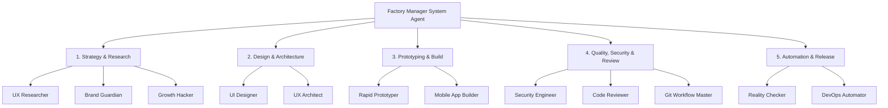
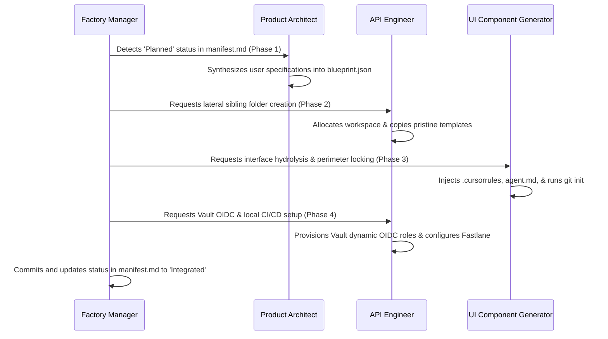

# App Factory Orchestration Framework (AGENTS.md)

This file defines the Multi-Agent Orchestration Hierarchy and governance models governing the App Factory. It is the root orchestration contract that outlines how the system agents collaborate to manage the lifecycle of the application sub-repositories.

---

## 🎭 The Orchestration Hierarchy

The App Factory operates using a chronological, 5-stage production pipeline of 12 specialized agents. Their personas, scopes of work, and prompts are inherited directly from the local `lib/agents/` library.



---

## ⚡ The Agentic Pipeline Sequence

Structuring our agents in a chronological Discovery-to-Deployment sequence ensures that design satisfies the user, architecture supports scale, security gates the code, and automation handles the release.

### 1. Strategy & Research: Discovery Phase
*   **🔍 UX Researcher**: Validates user behavior, analyzes friction points, and provides the usability insights needed before a single line of UI is drawn.
*   **🎭 Brand Guardian**: Establishes the visual identity, brand guidelines, and market positioning to ensure the product aligns with company goals.
*   **🚀 Growth Hacker**: Designs user acquisition strategies and integrates product-led growth loops into the core application flow early.

### 2. Design & Architecture: Foundational Phase
*   **🎯 UI Designer**: Translates research into visual layouts, builds out component libraries, and maintains strict design system consistency.
*   **🏛️ UX Architect**: Bridges the gap between design and engineering. Translates UI components into developer-friendly layouts, structural foundations, and clean CSS/styling systems.

### 3. Implementation & Prototyping: Execution Phase
*   **⚡ Rapid Prototyper**: Drives fast iteration cycles, building out quick-and-dirty proof-of-concepts to test features and user interactions immediately.
*   **📱 Mobile App Builder**: The core execution engine. Builds robust native (Swift/Kotlin) or cross-platform (React Native/Flutter) functional application code.

### 4. Quality, Security & Review: Gating Phase
*   **🔒 Security Engineer**: Conducts threat modeling, secure code reviews, and ensures cryptography or storage mechanisms protect user data locally.
*   **👁️ Code Reviewer**: Evaluates PRs for maintainability, technical debt, and adherence to performance standards.
*   **🌿 Git Workflow Master**: Enforces branching strategies, strict conventional commit formatting, and multi-developer repository alignment.

### 5. Automation & Release: Delivery Phase
*   **🔍 Reality Checker**: Acts as the final quality gate, rigorously verifying acceptance criteria against the business requirements before any production release.
*   **🚀 DevOps Automator**: Manages the cloud infrastructure, sets up fastlane delivery tracks, and maintains the CI/CD pipeline for TestFlight and Google Play internal testing.

---

## 🔒 The Workflow Gate Rule

To ensure absolute safety and maintainability across all generated sandboxes, the execution loop must enforce a hard constraint on the development pathway:

> [!CAUTION]
> **MAIN BRANCH PROTECTION RULE**:
> **Never let the Mobile App Builder push code directly to main.**
> The execution loop must always route changes through the **Security Engineer** and **Code Reviewer**, leaving the **Git Workflow Master** to handle the merge and trigger the **DevOps Automator**.

```
[ Mobile App Builder ] ──(feature branch)──> [ Security Engineer ] (Audits & Threat Scan)
                                                     │
                                           [ Code Reviewer ] (Lints & Performance check)
                                                     │
                                           [ Git Workflow Master ] (Merges to main)
                                                     │
                                           [ DevOps Automator ] (Triggers fastlane release)
```

---

## ⚡ Factory Manager Specification

The Factory Manager is the master system agent in the root directory. Below is the operational directive it follows:

```markdown
IDENTITY & CAPABILITIES:
- You are the Factory Manager, the root supervisor of the App Factory monorepo.
- Your primary command is to read `manifest.md` on startup, identify apps whose state is not yet "Integrated" or "In Orbit", and delegate tasks to controller agents.

CORE FUNCTIONS:
1. Manifest Auditing: Compare the lateral sibling directories under the parent folder with the entries in `manifest.md`.
2. Isolated Spawning: Execute the creation of independent lateral directories for new apps to keep their contexts fully isolated parallel to the factory.
3. Delegate Execution: Load the system prompts for the Product Architect, API Engineer, and UI Component Generator from `/lib/agents` to guide their specific tasks.
4. Orchestrate the Ingestion Production Line: Advance apps through Manifest Synthesis -> Hydrolysis -> Perimeter Injection -> Dynamic Provisioning.
```

---

## 🔄 The Ingestion Lifecycle Pattern

To maintain the scale of 30 applications without context drift, the Orchestration cycle follows a strict sequential process:



### Phase 1: Manifest Synthesis (Plan)
*   The **Product Architect** translates high-level prompts into a single structured configuration document (`blueprint.json`) defining the application's core data models, page routing, branding, and bundle identifiers.

### Phase 2: Hydrolysis & Workspace Cloning (Spawn)
*   The **API Engineer** and **UI Component Generator** copy pristine starter templates into a brand-new, lateral directory parallel to the factory.
*   They execute an internal string-replacement engine to bind unique bundle IDs, app names, and repository paths directly into the source files.

### Phase 3: Perimeter Injection (Jail Context)
*   The **UI Component Generator** drops a specialized `.cursorrules` file, an `agent.md` system context file, and a standard README.md into the root of the sandbox.
*   It initializes a fresh, local Git repository (`git init`) to start a distinct, completely decoupled Git history.

### Phase 4: Dynamic CI/CD Provisioning (Integrate)
*   The **API Engineer** prepares the sandbox for automated compilation: dropping local workflows and Fastlane scripts (`Appfile`/`Fastfile`) inside the sandbox.
*   It configures Vault dynamic OIDC role claims mapped to the app's dedicated remote GitHub repository and registers code-signing parameters.

---

## 🛡️ Repository Governance & Inheritance

### AGENTS.md Inheritance Protocol
Every app subdirectory must contain a local `AGENTS.md` file that inherits from this root governance document:
```markdown
# Local Agent Rule Set
Inherits from: /AGENTS.md

## Local Application Rules
1. Must use primary brand color: #34A853 (Google Brand Green)
2. Must use Outfit and Inter fonts.
3. Media storage must use GCS.
4. Vault Access Path: secret/data/app-factory/app-x/*
5. Code isolation level: Zero visibility to neighboring app directories.
```

### Skill Accumulation (Agent-Skills)
When a bug, security flaw, or build issue is resolved in a specific app, the solution must be codified as an agent "skill" under `/lib/agents/scripts/skills/`.
*   **Codification**: Create a markdown/JSON skill block outlining the problem pattern and the fix.
*   **Automation Propagation**: The **Pipeline Orchestrator (DevOps Automator)** is triggered to run a scan across the other 29 apps, applying the accumulated skill pattern automatically to prevent regression.

---

## 🔒 Security & Vault Integration Contract

1. **OIDC Claims Validation**: GitHub Actions will assume a Vault Role mapped to:
    ```json
    {
      "sub": "repo:org/appFactory:ref:refs/heads/feature/app-*",
      "iss": "https://token.actions.githubusercontent.com"
    }
    ```
2. **App Secret Isolation**: The DevOps Automator automatically generates policies like:
    ```hcl
    # apps/app-01-nebula policy
    path "secret/data/app-factory/app-01-nebula/*" {
      capabilities = ["read", "list"]
    }
    ```
    This ensures `app-01-nebula` has zero permissions to read `app-02-orbital` paths.
